# 🚀 Azure Copilot App

This folder contains the main application code for the **Azure Agentic Copilot** project — a modular, enterprise-ready AI system built using **Azure AI Foundry**, **Copilot Studio**, and **Power Platform** integrations.

---

## 🧠 Project Story & Outcomes

### **1. Backend Implementation & Agent Orchestration
- The foundation of this project is a modular FastAPI backend (`app/main.py`) that orchestrates all agent logic.
- Agents (Retrieval, Supervisor, Report, Automation) are implemented as Python modules in `app/agents/` and can be extended or recomposed for new business scenarios.
- API endpoints expose agentic workflows for integration with Copilot Studio, Teams, and Power Automate.
- Incoming requests are routed through FastAPI, triggering agentic execution and returning structured responses.

---

### **2. Design & Implementation**
- Modular agents created in **Azure AI Foundry** for retrieval, supervision, reporting, and automation.  
- Each agent performs a defined business function and can be orchestrated collectively via a Supervisor Agent.

📸 *Azure AI Foundry — Multi-Agent Setup*  
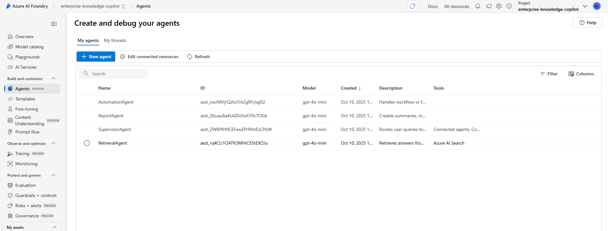

📸 *Supervisor Agent generating summarized reports*  
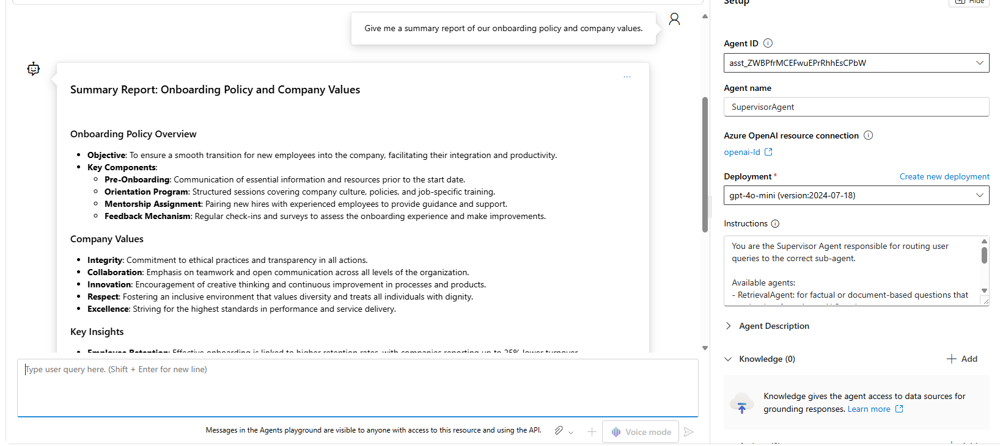

---

### **3. System Architecture & Traceability**
- Each user query triggers a **traceable agentic execution** across multiple sub-agents.  
- **Thread logs**, **metadata**, and **connected agent outputs** provide transparency into all message flows and tool calls.

📸 *Agent Thread Execution — Step-by-Step Run Log*  
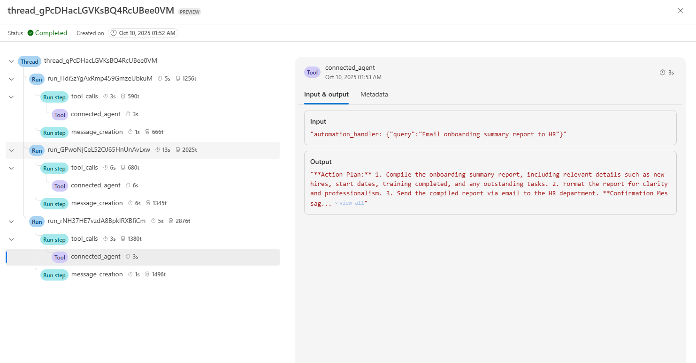

📸 *Thread Logs Summary — Multi-Agent Orchestration Trace*  
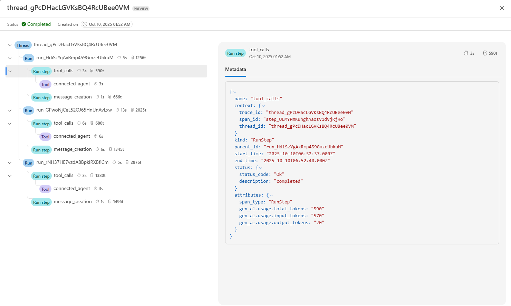

📸 *Tool Call Details — Metadata and Token Usage*  
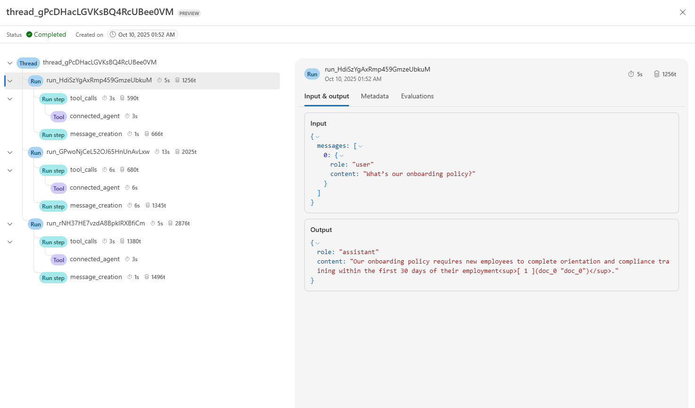

📸 *Connected Agent Outputs — Automation Steps and Action Plans*  
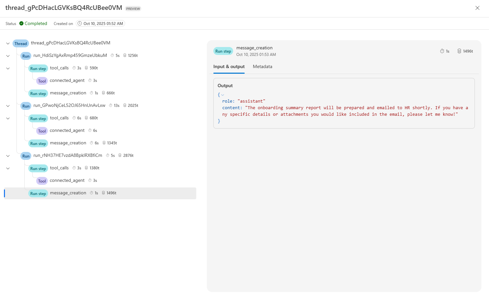

---

### **4. Integration & Orchestration**
- Agents are integrated through **Copilot Studio**, creating a seamless conversational workflow.  
- Workflow: **Teams → Copilot Studio → FastAPI → Azure Foundry Agents → AI Search Results**.

📸 *Copilot Studio — Summarized Report Output*  
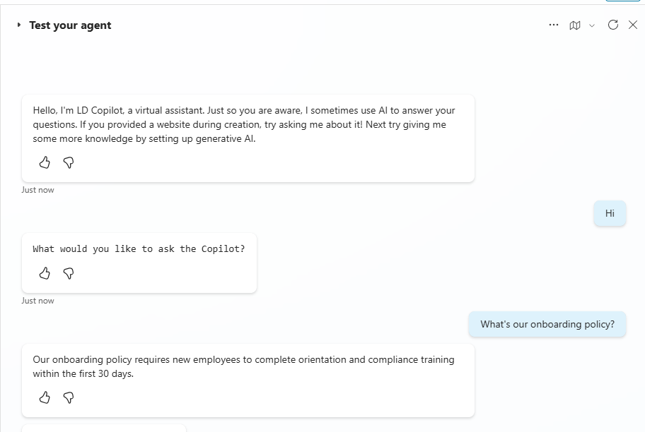

📸 *Copilot Studio — Agent and Topic Setup*  
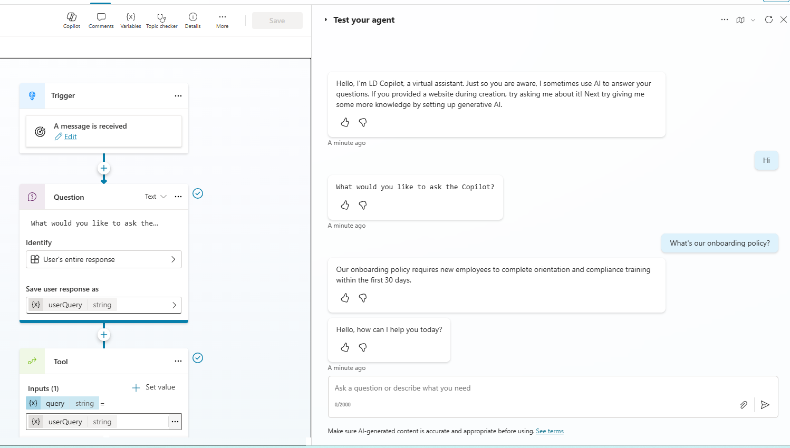

📸 *Copilot Studio — Query Flow Sending Requests to FastAPI*  
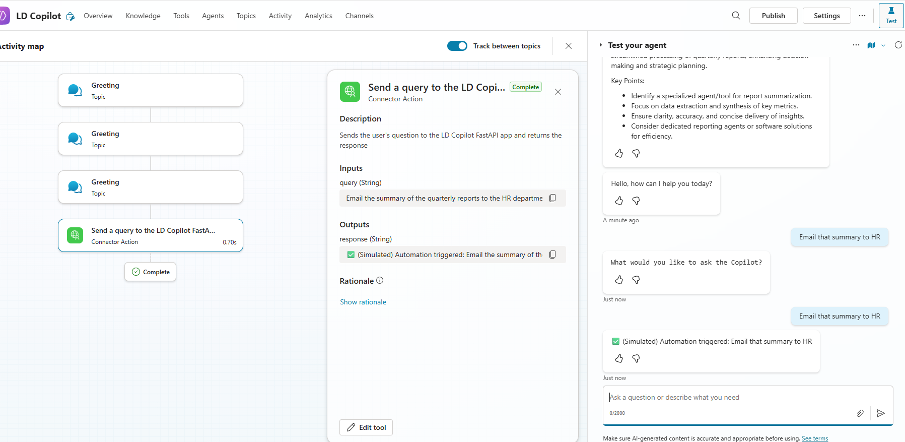

📸 *Copilot Studio — Tools and Topics Overview*  
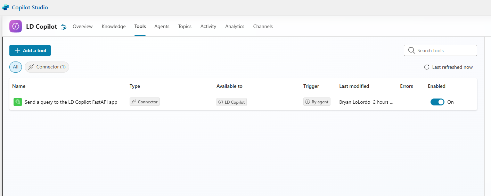

---

### **5. Deployment & Validation**
- The application is hosted on **Azure App Service** for scalable deployment and real-time interaction through Copilot Studio.  
- Validated using both **Copilot Studio Test Environment** and **Teams** chat for live testing.

📸 *Copilot Studio — Enhanced Chat Summary Output*  
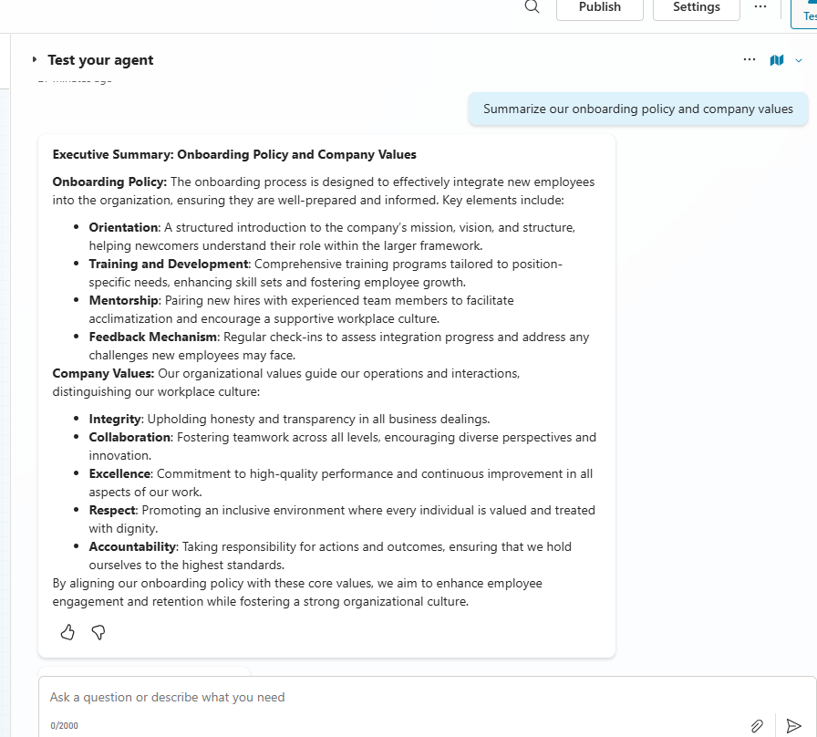

---

### **6. Outcome & Impact**
- Created an **end-to-end, AI-powered Copilot** integrated with Azure’s agentic framework.  
- Demonstrated multi-agent orchestration, secure backend communication, and seamless Copilot integration.  
- Delivered a scalable architecture for **enterprise-grade knowledge assistance** and **process automation**.

---

